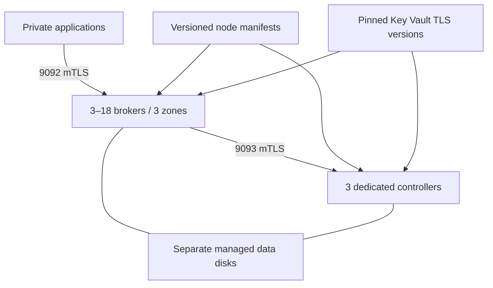

# Kafka on Azure

[](https://github.com/rclevenger-hm/kafka-azure-deployment/actions/workflows/ci.yml)

Self-managed Apache Kafka 4.3.1 on private Azure virtual machines, with three dedicated KRaft controllers and three or more brokers spread across three availability zones. Terraform provisions infrastructure; a guarded Python bootstrap installs the runtime; operating guides cover acceptance, recovery, upgrades and certificates.

Builds on the [AWS](https://github.com/rclevenger-hm/kafka-aws-deployment), [GCP](https://github.com/rclevenger-hm/kafka-gcp-deployment) and [OCI](https://github.com/rclevenger-hm/kafka-oci-deployment) deployments. The [comparison](docs/parity.md) separates implemented capabilities from live-cloud qualification. This reference implementation has automated source and Kafka tests; an Azure production deployment still requires the [acceptance checks](docs/acceptance.md).

## Included

- Private VNet, three zonal NAT gateways, private DNS, explicit network deny rules and private endpoints for Blob Storage and Key Vault.
- Separate encrypted Premium SSD v2 disks, stable identities, managed-disk/LUN verification, filesystem guards and protected compute/storage.
- Per-node user-assigned managed identities, secret-scoped Key Vault access and container-scoped runtime reads.
- Mutual TLS on every Kafka listener, hostname verification, default-deny ACLs, RF3 and minimum ISR2.
- Versioned Blob manifests that separate Terraform changes from explicit one-node runtime refreshes.
- Pinned Kafka/JMX checksums, unprivileged hardened systemd services and a lab certificate generator.
- Health, smoke, capacity and Azure administration tools; Prometheus alerts, a Grafana dashboard, VNet flow logs and VM availability alerts.
- Python regression tests, Terraform mock plans and a real six-process exercise covering TLS, denied ACLs, broker outage writes, retained data and controller leader failover.

## Start here

Read [deployment](docs/deployment.md), [security](docs/security.md) and [capacity](docs/capacity-planning.md). Bring an existing protected state account, private management runner, RBAC-enabled private Key Vault, six pinned TLS secret versions and a reviewed Ubuntu 24.04 image version. Example inputs deliberately contain placeholders.

```bash
make check
make terraform
make integration
```

Repository checks require no Azure credentials and create no cloud resources. Terraform uses the committed provider lockfile and an Azure Blob backend with lease locking. An optional manual [deployment workflow](.github/workflows/deploy.yml) requires your own private runner, workload identity and protected environment.

## Topology



Clients need private routing and resolution for every advertised broker. Nodes have no public IPs. Run Command offers management through the VM agent; an existing Bastion/private SSH path is optional and its CIDR defaults closed. The runtime storage public endpoint permits only the existing deployment subnet; nodes use its private endpoint. Key Vault public access must be disabled.

## Boundaries and resources

Default infrastructure includes six VMs, 1,650 GiB of data disks, six 32 GiB OS disks, three NAT gateways/public egress IPs, two private endpoints and six availability alerts. Flow logs add a storage account. Review regional availability, quota and pricing before applying.

Prometheus/Grafana servers, client connectivity, organizational PKI, the existing Network Watcher, human permissions and remote disaster recovery clusters are prerequisites or separate systems. A successful apply is not Kafka readiness. Live Azure provisioning, agent access, disk recovery, zone failure, performance and DR remain environment-specific acceptance gates.

## Repository map

| Path | Purpose |
|---|---|
| [terraform](terraform/README.md) | Azure infrastructure, inputs and mock plans |
| [bootstrap](bootstrap/provision.py) | Managed disk, identity, TLS and runtime installation |
| [tools](tools/azure_admin.py) | Administration, health, smoke, capacity and lab PKI |
| [monitoring](monitoring/alerts.yml) | Rules, tests, scrape example and dashboard |
| [tests](tests/integration.py) | Regression and six-process fault exercises |
| [docs](docs/README.md) | Deployment and operating guides |

[MIT license](LICENSE). See [CONTRIBUTING.md](CONTRIBUTING.md), [SECURITY.md](SECURITY.md) and [NOTICE](NOTICE).
